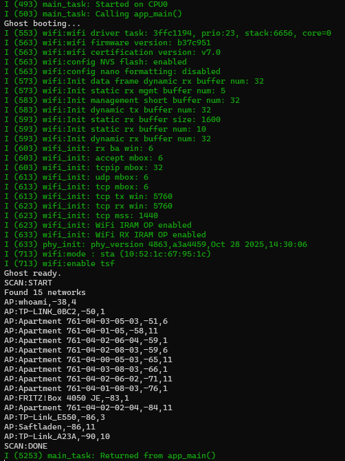
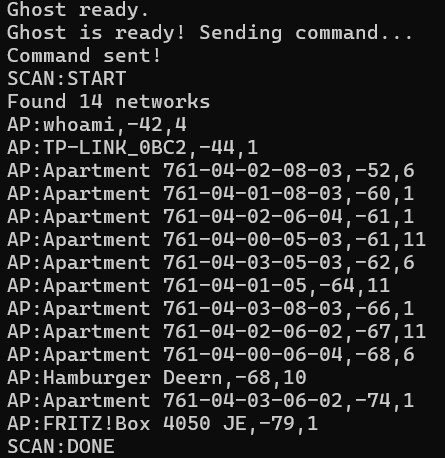

# Ghost — Custom ESP32 WiFi Scanner Firmware

A custom ESP32 firmware for WiFi network scanning built from scratch using ESP-IDF. Communicates over UART using a simple text-based protocol.

---

## Hardware Required

- NodeMCU ESP32-WROOM-32 (38-pin version)
- USB cable (data capable, not charge-only)

---

## Development Environment Setup (Windows)

### 1. Install ESP-IDF

Download and run the ESP-IDF Windows Installer:
- Select **Core** features only
- Select all **Required Tools** (11 tools)
- Install to `C:\esp32`

### 2. Activate ESP-IDF environment

Open CMD (not PowerShell) and run:

```cmd
C:\esp32\v6.0.1\esp-idf\install.bat esp32
C:\esp32\v6.0.1\esp-idf\export.bat
```

> You must run `export.bat` every time you open a new CMD window.

---

## Project Setup

```cmd
cd "your\project\folder"
idf.py create-project ghost
cd ghost
idf.py set-target esp32
```

## Build & Flash

### Build
```cmd
C:\esp32\v6.0.1\esp-idf\export.bat
cd "your\project\folder\ghost"
idf.py build
```

### Flash
```cmd
idf.py -p COM3 flash
```

> **Important:** When `Connecting......` appears, hold the **BOOT** button on the NodeMCU and release it once the flashing starts in the terminal.

---

## Monitor (optional)

You can watch the scan output live directly in the terminal:

```cmd
idf.py -p COM3 monitor
```

Once Ghost boots the scan runs automatically and you will see the networks printed in real time:



Press **Strg+]** to exit the monitor.

---

## Testing via Python

Create a `Scan.py` file in the project folder:

```python
import serial
import time

s = serial.Serial('COM3', 115200, timeout=10)

print("Waiting for boot...")
while True:
    line = s.readline().decode('latin-1').strip()
    print(line)
    if 'Ghost ready' in line:
        print("Ghost is ready! Sending command...")
        break

time.sleep(1)
s.write(b'CMD:SCAN_AP\n')
print("Command sent!")

start = time.time()
while time.time() - start < 15:
    line = s.readline().decode('latin-1').strip()
    if line:
        print(line)

s.close()
```

Run it:
```cmd
python Scan.py
```



---

## UART Protocol

| Command        | Description               |
|----------------|---------------------------|
| `CMD:SCAN_AP`  | Scan nearby WiFi networks |

| Response          | Description        |
|-------------------|--------------------|
| `GHOST:READY`     | Firmware booted    |
| `SCAN:START`      | Scan started       |
| `AP:SSID,RSSI,CH` | Network found      |
| `SCAN:DONE`       | Scan complete      |
| `ERR:UNKNOWN`     | Unknown command    |

---

## UART Pinout

The firmware is configured for UART2 (GPIO16/GPIO17) by default. However depending on your ESP32 board, the physical pins that respond may differ. Check your board's datasheet to find the correct TX and RX pins.

> **Note:** On the NodeMCU ESP32-WROOM-32 used in this project, UART2 responded on the **TX0 and RX0** physical pins of the board.

```
Firmware config: UART2 — GPIO17 (TX), GPIO16 (RX)
Tested on:       TX0 / RX0 physical pins
Baud rate:       115200
```

---

## Roadmap

- [x] UART communication
- [x] WiFi AP scanning


---

## License

MIT
